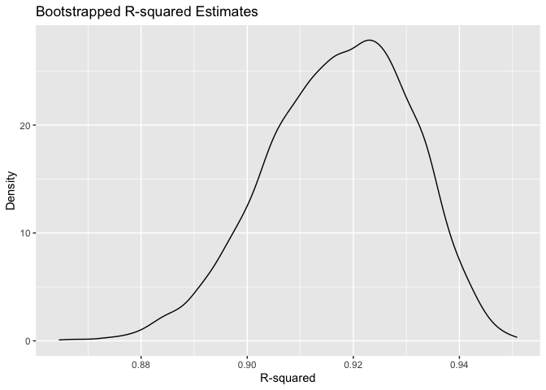
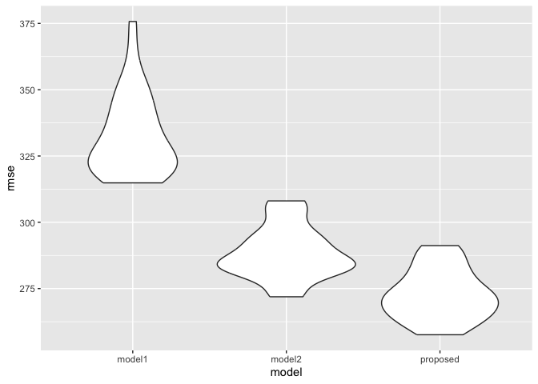

p8105_hw6_md4270
================
Manye Dong
2023-11-18

``` r
library(tidyverse)
library(readr)
library(broom)
library(boot)
library(modelr)
```

## Problem 1

``` r
homicide = read_csv("homicide-data.csv")
```

Create a city_state variable (e.g. “Baltimore, MD”), and a binary
variable indicating whether the homicide is solved. Omit cities Dallas,
TX; Phoenix, AZ; and Kansas City, MO – these don’t report victim race.
Also omit Tulsa, AL – this is a data entry mistake. For this problem,
limit your analysis those for whom victim_race is white or black. Be
sure that victim_age is numeric.

``` r
homicide_clean = 
  homicide |>
  janitor::clean_names() |>
  mutate(city_state = paste(city, state, sep = ", "), 
         resolved = as.numeric(disposition == "Closed by arrest"),
         victim_age = as.numeric(victim_age)) |>
  filter(!city_state %in% c("Dallas, TX", "Phoenix, AZ", "Kansas City, MO", "Tulsa, AL")& 
           victim_race %in% c("White", "Black") & 
           victim_sex != "Unknown") |>
  select(city_state, victim_age, victim_sex, victim_race, resolved)
```

``` r
train_data = 
  homicide_clean |>
  filter(city_state == "Baltimore, MD")
```

Fit the logistic regression model:

``` r
logistic_reg = glm(resolved ~ victim_age + victim_sex + victim_race, data = train_data, family = binomial())
```

Extract the estimates and confidence intervals for male vs female
victims:

``` r
tidy_result = 
  logistic_reg|>
  broom::tidy(conf.int = T) |>
  filter(term=="victim_sexMale") |>
  mutate(odds_ratio = exp(estimate),
         lower_ci = exp(conf.low),
         upper_ci = exp(conf.high)) |>
  select(term, odds_ratio, lower_ci, upper_ci) |>
  knitr::kable(digits = 3)

tidy_result
```

| term           | odds_ratio | lower_ci | upper_ci |
|:---------------|-----------:|---------:|---------:|
| victim_sexMale |      0.426 |    0.324 |    0.558 |

Now run glm for each of the cities in your dataset, and extract the
adjusted odds ratio (and CI) for solving homicides comparing male
victims to female victims. Do this within a “tidy” pipeline, making use
of purrr::map, list columns, and unnest as necessary to create a
dataframe with estimated ORs and CIs for each city.

``` r
test_all_cities = function(city, df){
  df |> 
    filter(city_state == city) |>
    glm(resolved ~ victim_age + victim_sex + victim_race, data = _, family = "binomial") |>
    broom::tidy(conf.int = T) |>
    filter(term=="victim_sexMale") |>
    mutate(odds_ratio = exp(estimate),
           lower_ci = exp(conf.low),
           upper_ci = exp(conf.high)) |>
    select(term, odds_ratio, lower_ci, upper_ci)
}
```

``` r
cities = unique(homicide_clean$city_state)

for_all_cities = tibble(
  city = cities,
  test = map(cities, test_all_cities, df = homicide_clean)
) |> 
  unnest(test) |>
  select(-term)
```

Create a plot that shows the estimated ORs and CIs for each city.
Organize cities according to estimated OR, and comment on the plot.
\[edit\]

``` r
for_all_cities |>
  mutate(city_state = fct_reorder(city, odds_ratio)) |>
  ggplot(aes(x = city_state, y = odds_ratio, color = city_state)) +
  geom_point() +
  geom_errorbar(aes(ymin = lower_ci, ymax = upper_ci)) +
  theme_bw() +
  labs(x = "City State", y = "Odds Ratio", title = "Odds Ratio by Sex") +
  theme(plot.title = element_text(hjust = 0.5), axis.title.x = element_blank(),
        axis.text.x = element_blank(), axis.ticks.x = element_blank())
```

<!-- -->

## Problem 2

``` r
weather_df = 
  rnoaa::meteo_pull_monitors(
    c("USW00094728"),
    var = c("PRCP", "TMIN", "TMAX"), 
    date_min = "2022-01-01",
    date_max = "2022-12-31") |>
  mutate(
    name = recode(id, USW00094728 = "CentralPark_NY"),
    tmin = tmin / 10,
    tmax = tmax / 10) |>
  select(name, id, everything())
```

Write function for one time model fit:

``` r
boot_strap = weather_df |>  
  modelr::bootstrap(n = 5000) |> 
  mutate(
    mods = map(strap, ~lm(tmax ~ tmin + prcp, data = .x)),
    mods_beta = map(mods, broom::glance),
    mods_r2 = map(mods, broom::tidy)) |> 
  unnest(mods_r2, mods_beta) |> 
  dplyr::select(.id, term, estimate, r.squared) |> 
  pivot_wider(names_from = term, values_from = estimate) |> 
  rename(
    beta_0 = `(Intercept)`,
    beta_1 = tmin,
    beta_2 = prcp) |> 
  summarise(r.squared = r.squared,
    log_beta12 = log(beta_1 * beta_2),
    log_beta01 = log(beta_0 * beta_1))
```

Extract quantile:

``` r
r2_ci = 
  quantile(boot_strap$r.squared, probs = c(0.025,0.975)) |> 
  knitr::kable(digits=4)

log_ci = 
  quantile(boot_strap$log_beta01, probs = c(0.025,0.975)) |>  
  knitr::kable(digits=4)

r2_ci
```

|       |      x |
|:------|-------:|
| 2.5%  | 0.8892 |
| 97.5% | 0.9406 |

``` r
log_ci
```

|       |      x |
|:------|-------:|
| 2.5%  | 2.0565 |
| 97.5% | 2.1385 |

Plot:

``` r
boot_strap |> 
  ggplot(aes(x = r.squared)) +
  geom_density() +
  labs(title = "Distribution of Bootstrapped R-squared Estimates", x = "R-squared", y = "Density")
```

<!-- -->

``` r
boot_strap |> 
  ggplot(aes(x = log_beta12)) +
  geom_density() +
  labs(title = "Distribution of Bootstrapped log(beta1*beta2) Estimates", x = "log(beta1*beta2)", y = "Density")
```

<!-- -->

``` r
boot_strap |> 
  ggplot(aes(x = log_beta01)) +
  geom_density() +
  labs(title = "Distribution of Bootstrapped log(beta0*beta1) Estimates", x = "log(beta0*beta1)", y = "Density")
```

<!-- -->

## Problem 3

Load and clean the data for regression analysis (i.e. convert numeric to
factor where appropriate, check for missing data, etc.).

``` r
birthweight = 
  read_csv("birthweight.csv") |>
  janitor::clean_names() |>
  mutate(babysex = ifelse(babysex == 1, "Male", "Female"),
         malform = ifelse(malform == 0, "Absent", "Present"),
         frace = recode(frace, "1" = "White", "2" = "Black", "3" = "Asian", "4" = "Puerto Rican", "8" = "Other", "9" = "Unknown"),
         mrace = recode(mrace, "1" = "White", "2" = "Black", "3" = "Asian", "4" = "Puerto Rican", "8" = "Other")) |>
  drop_na()
```

To propose and fit a model, we will first examine the correlation
between each pairs of variables using a correlation matrix:

``` r
mlr_data = birthweight |>
  mutate(babysex = ifelse(babysex == "Male", 1, 0), 
         malform = ifelse(malform == "Absent", 0, 1),
         frace = as.numeric(recode(frace, "White"="1", "Black"="2", "Asian"="3", "Puerto Rican"="4", "Other"="8", "Unknown"="9")),
         mrace = as.numeric(recode(mrace, "White"="1", "Black"="2", "Asian"="3", "Puerto Rican"="4", "Other"="8")))

cor_matrix = cor(mlr_data[, c(colnames(mlr_data))])
```

``` r
# Find the pairs where correlation is greater than or equal to 0.7 but less than 1
high_cor_pairs = which(cor_matrix >= 0.7 & cor_matrix < 1, arr.ind = TRUE)

# Extract the variable names for these pairs
high_cor_var_pairs = data.frame(
  Var1 = rownames(cor_matrix)[high_cor_pairs[, 1]],
  Var2 = colnames(cor_matrix)[high_cor_pairs[, 2]],
  Correlation = cor_matrix[high_cor_pairs]
)

high_cor_var_pairs |> 
  knitr::kable(digits=4)
```

| Var1    | Var2    | Correlation |
|:--------|:--------|------------:|
| bwt     | bhead   |      0.7471 |
| bwt     | blength |      0.7435 |
| bhead   | bwt     |      0.7471 |
| blength | bwt     |      0.7435 |
| ppbmi   | delwt   |      0.7205 |
| ppwt    | delwt   |      0.8709 |
| mrace   | frace   |      0.8286 |
| frace   | mrace   |      0.8286 |
| delwt   | ppbmi   |      0.7205 |
| ppwt    | ppbmi   |      0.8533 |
| delwt   | ppwt    |      0.8709 |
| ppbmi   | ppwt    |      0.8533 |

Based on the correlation matrix, we want to exclude some variables from
highly correlated pairs (correlation \>=0.7) to avoid multicollinearity.
The pairs are (ppbmi delwt), (ppwt delwt), (ppwt ppbmi), (mrace frace).

``` r
cor_ppbmi = cor_matrix["bwt", "ppbmi"]
cor_delwt = cor_matrix["bwt", "delwt"]
cor_ppwt = cor_matrix["bwt", "ppwt"]

c(cor_ppbmi, cor_delwt, cor_ppwt)
```

    ## [1] 0.09394573 0.28788931 0.18289196

Given the three variables’ correlation with outcome bwt, we will only
keep the one with highest aboslute correlation, which is delwt.

``` r
cor_frace = cor_matrix["bwt", "frace"]
cor_mrace = cor_matrix["bwt", "mrace"]

c(cor_frace, cor_mrace)
```

    ## [1] -0.1793900 -0.2076689

Similarly, given the two variables’ correlation with outcome bwt, we
will only keep the one with higher absolute correlation, which is
cor_mrace.

``` r
proposed_data = 
  birthweight |> 
  select(-frace, -ppbmi, -ppwt)
  
# Fit the model
mlr = lm(bwt ~ ., data = proposed_data)
```

Plot residuals against fitted values:

``` r
# Add predictions to the dataset
df_with_predictions = proposed_data |>
  add_predictions(mlr, var = "fitted_values")

# Add residuals to the dataset
df_with_residuals = df_with_predictions |>
  add_residuals(mlr, var = "residuals")

# Now plot the residuals against fitted values
ggplot(df_with_residuals, aes(x = fitted_values, y = residuals)) +
  geom_point() +
  geom_hline(yintercept = 0, linetype = "dashed", color = "red") +
  labs(x = "Fitted Values", y = "Residuals", title = "Residuals against Fitted Values") +
  theme_minimal()
```

<!-- -->

Compare my proposed model with two other models in the instruction:

``` r
cv_df = 
  crossv_mc(birthweight, 30) |> 
  mutate(
    model1 = map(train, \(train) lm(bwt ~ blength + gaweeks, data = train) ),
    model2 = map(train, \(train) lm(bwt ~ bhead * blength * babysex, data = train)),
    proposed = map(train, \(train) lm(bwt ~ babysex + bhead + blength + bwt + delwt + fincome + gaweeks + malform + menarche + mheight + momage + mrace + parity + pnumlbw + pnumsga + smoken + wtgain, data = train))
  ) |> 
  mutate(
    rmse_model1 = map2_dbl(model1, test, \(mod, test) rmse(model = mod, data = test)),
    rmse_model2 = map2_dbl(model2, test, \(mod, test) rmse(model = mod, data = test)),
    rmse_proposed = map2_dbl(proposed, test, \(mod, test) rmse(model = mod, data = test))
  )
```

``` r
cv_df |> 
  select(starts_with("rmse")) |> 
  pivot_longer(
    everything(),
    names_to = "model", 
    values_to = "rmse",
    names_prefix = "rmse_") |> 
  mutate(model = fct_inorder(model)) |> 
  ggplot(aes(x = model, y = rmse)) + geom_violin()
```

<!-- -->

Based on the violin plot, our proposed model with more predictors has
the lowest range of distribution of Root Mean Square Error (RMSE).
Model1 with only birth length and gestational age as predictors has the
highest range of distribution of RMSE values.
